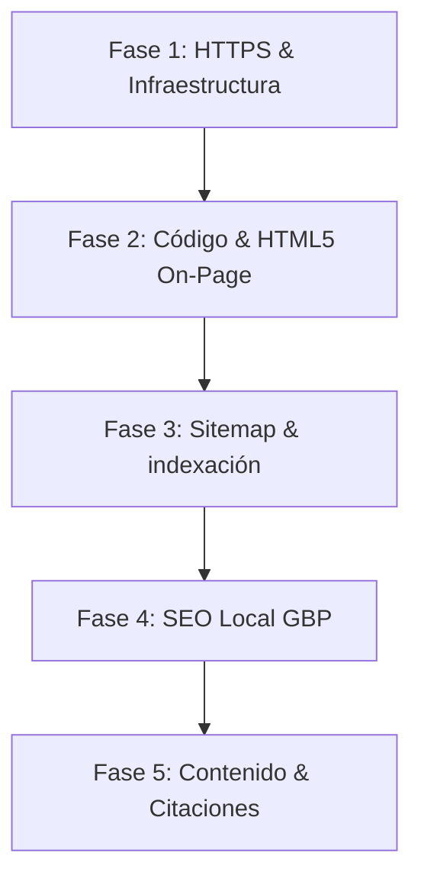

# CaeliTandem SEO Strategy & Technical Implementation
**Proyecto:** Landing Page CaeliTandem (www.caelitandem.lat)  
**Ubicación de Enfoque:** Huajuapan de León, Región Mixteca, Oaxaca, México  
**Fecha de Emisión/Actualización:** 24 de Mayo de 2026  
**Documento Unificado de Implementación y Estrategia**

---

## 🎯 Objetivos Estratégicos

1. **Posicionamiento Local Dominante (Local SEO):** Convertir a CaeliTandem en la opción líder en búsquedas orgánicas sobre desarrollo de software, modernización de sistemas y consultoría tecnológica en **Huajuapan de León** y la **Región Mixteca** (Juxtlahuaca, Tlaxiaco, Nochixtlán, etc.).
2. **Generación de Prospectos (Leads):** Capturar tráfico comercial caliente (negocios locales, comités de servicios, cooperativas) interesado en la automatización de procesos y modernización de bases de datos.
3. **Optimización Técnica (Core Web Vitals & Seguridad):** Lograr una carga veloz del sitio, indexación 100% libre de errores bajo HTTPS, y proveer una estructura de datos semántica comprensible para Google.

---

## 🗺️ Mapa de Ruta del Proyecto SEO



---

## 🛠️ Fase 1: Infraestructura y Servidor (HTTPS / SSL)
El sitio web está alojado en una máquina virtual de Oracle Cloud (`oci-vm`) servido por **Nginx 1.18**. Un pilar de la confianza de Google es la seguridad y la correcta redirección de puertos.

### A. Redirección HTTP a HTTPS (301)
Se configuró en Nginx un bloque de servidor que capta cualquier petición por puerto 80 (HTTP) y la redirige con código `301` (redirección permanente) a la dirección segura HTTPS de `www.caelitandem.lat`.
* **Configuración en `/etc/nginx/sites-available/caelitandem.lat`**:
  ```nginx
  server {
      listen 80;
      listen [::]:80;
      server_name caelitandem.lat www.caelitandem.lat;
      return 301 https://www.caelitandem.lat$request_uri;
  }
  ```

### B. Ciclo de Vida SSL Automatizado (Let's Encrypt)
Se implementó un mecanismo de renovación periódica del certificado que previene expiraciones mediante tareas automatizadas.
* **Script de Renovación (`/home/ubuntu/scripts/renew-certs.sh`)**:
  ```bash
  #!/usr/bin/env bash
  # Intenta renovar el certificado y recarga nginx si hubo éxito
  certbot renew --post-hook "systemctl reload nginx" >> /home/ubuntu/logs/certbot-renew.log 2>&1
  ```
* **Tarea Programada (`/etc/cron.d/certbot-custom`)**:
  Ejecuta la validación diariamente a las 3:00 AM como usuario `root`.
  ```cron
  0 3 * * * root /home/ubuntu/scripts/renew-certs.sh >/dev/null 2>&1
  ```

---

## 🖥️ Fase 2: Optimización On-Page y Código HTML (`index.html`)
Aplicamos mejoras en el archivo fuente de la landing page para cumplir rigurosamente con los estándares modernos de HTML5 y SEO on-page:

### A. Implementación de Canonical Tag
Se añadió una etiqueta canonical en el `<head>` para indicar a los motores de búsqueda cuál es la URL principal y legítima del sitio, evitando penalizaciones por duplicidad si se accede por IP o subdominios sin configurar:
```html
<link rel="canonical" href="https://www.caelitandem.lat/">
```

### B. Jerarquía Semántica (Etiqueta H1 Única)
Anteriormente, el sitio carecía de un título `<h1>` en el cuerpo. Corregimos el contenedor del Hero Band para darle relevancia y jerarquía correctas para los bots:
* **Código Implementado:**
  ```html
  <div class="hero-band" id="hero-band">
      <h1 class="hero-band-title">Desarrollo, Migración y Optimización de <span>Software a la Medida para su Negocio</span></h1>
  </div>
  ```

### C. Datos Estructurados (LocalBusiness JSON-LD)
Actualizamos la configuración de los metadatos de Schema.org en `index.html` para reflejar el uso de **HTTPS** y la ubicación física en Huajuapan, permitiendo que Google identifique de inmediato a qué sector pertenece el negocio:
```json
<script type="application/ld+json">
{
  "@context": "https://schema.org",
  "@type": "ProfessionalService",
  "name": "CaeliTandem Sistemas",
  "image": "https://www.caelitandem.lat/mapa_mixteca_distritos.webp",
  "@id": "https://www.caelitandem.lat/#organization",
  "url": "https://www.caelitandem.lat",
  "telephone": "+529531156883",
  "priceRange": "$$",
  "address": {
    "@type": "PostalAddress",
    "streetAddress": "Centro",
    "addressLocality": "Huajuapan de León",
    "addressRegion": "Oaxaca",
    "postalCode": "69000",
    "addressCountry": "MX"
  },
  "geo": {
    "@type": "GeoCoordinates",
    "latitude": 17.8083,
    "longitude": -97.7783
  },
  "openingHoursSpecification": {
    "@type": "OpeningHoursSpecification",
    "dayOfWeek": ["Monday", "Tuesday", "Wednesday", "Thursday", "Friday", "Saturday"],
    "opens": "09:00",
    "closes": "18:00"
  },
  "sameAs": [
    "https://wa.me/529531156883"
  ]
}
</script>
```

---

## 📈 Fase 3: Indexación y Enlace de Sitios (Sitemaps & Robots)
Alineamos el sitemap de la webapp con el protocolo seguro para una indexación correcta:

### A. Sitemap Actualizado (`sitemap.xml`)
Se actualizaron las referencias de URL al protocolo HTTPS oficial y la fecha de última edición al **24 de Mayo de 2026**:
```xml
<?xml version="1.0" encoding="UTF-8"?>
<urlset xmlns="http://www.sitemaps.org/schemas/sitemap/0.9">
   <url>
      <loc>https://www.caelitandem.lat/</loc>
      <lastmod>2026-05-24</lastmod>
      <changefreq>monthly</changefreq>
      <priority>1.0</priority>
   </url>
</urlset>
```

### B. Robots.txt (`robots.txt`)
Enlaza el mapa de navegación directamente para acelerar el rastreo:
```txt
User-agent: *
Allow: /

Sitemap: https://www.caelitandem.lat/sitemap.xml
```

---

## 📍 Fase 4: SEO Local y Presencia Regional
Para un posicionamiento óptimo en la Mixteca, el canal de mapas de Google es fundamental.

### A. Configuración de Google Business Profile (GBP)
1. **Creación:** Acceder a [Google Business Profile](https://www.google.com/business/) con la cuenta oficial.
2. **Nombre Canónico:** Usar `CaeliTandem Sistemas`.
3. **Categoría Principal:** `Servicio de desarrollo de software` o `Consultor informático`.
4. **Dirección Física Completa:**
   > Chapultepec #12, Col. Aviación 1era sección, C.P. 69007, Huajuapan de León, Oaxaca.
5. **Horarios de Atención:** Lunes a Sábado de 9:00 AM a 6:00 PM.
6. **Enlace Principal:** `https://www.caelitandem.lat/`.
7. **Reseñas Locales:** Solicitar valoraciones de 5 estrellas de clientes del área (como comités locales o empresas beneficiarias del software de agua) para mejorar la posición en el Local Pack.

---

## ✍️ Fase 5: Estrategia de Contenidos y Palabras Clave
El posicionamiento a mediano plazo depende de la relevancia del contenido para responder a las búsquedas de los clientes.

### A. Matriz de Palabras Clave Core
| Tipo de Búsqueda | Palabra Clave | Competencia | Intención de Búsqueda |
| :--- | :--- | :--- | :--- |
| **Local / Región** | `desarrollo de software en huajuapan de leon` | Baja-Media | Muy Alta (Contratación directa) |
| **Estatal / Oaxaca** | `programacion a la medida oaxaca` | Media | Alta (Evaluación técnica) |
| **Nicho Técnico** | `migracion de base de datos excel a web` | Baja | Media-Alta (Solución de problemas) |
| **Solución Municipal** | `sistema cobro agua potable oaxaca` | Baja | Crítica (Cooperativas y Comités) |

### B. Casos de Estudio Reales (Estrategia de Autoridad)
Para sustentar las capacidades de desarrollo de CaeliTandem, se deben publicar páginas internas (o entradas de blog) de casos prácticos locales:
* **Caso de Éxito: Sistema de Agua Potable V2.0:** Explicar el saneamiento de datos de 200k+ registros de la base de datos de cargos, la optimización de código migrado a PHP 7.4/8, la resiliencia contra fallas eléctricas de UPS, y el ahorro de papel en los tickets de asamblea.
* **Caso de Éxito: Portales locales para Productores y Comercios de la Región.**

---

## 🔍 Herramienta de Auditoría y Verificación

1. **Google Search Console (GSC):**
   * Verificar la propiedad agregando `https://www.caelitandem.lat/` mediante registro TXT de DNS.
   * Cargar el sitemap enviando `sitemap.xml` en la sección correspondiente.
   * Inspeccionar la URL principal y dar clic en **"Solicitar Indexación"** tras subir las mejoras del H1.
2. **Validador de Esquema:**
   * Probar el código HTML en la herramienta de [Google Rich Results Test](https://search.google.com/test/rich-results) para confirmar que el JSON-LD de `ProfessionalService` no arroje errores ni advertencias.
3. **Prueba de Rendimiento (PageSpeed Insights):**
   * Comprimir las imágenes en formato WebP para mejorar el tiempo de carga móvil a menos de 2 segundos.
