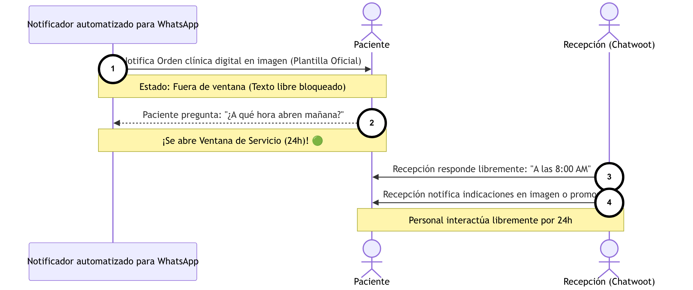
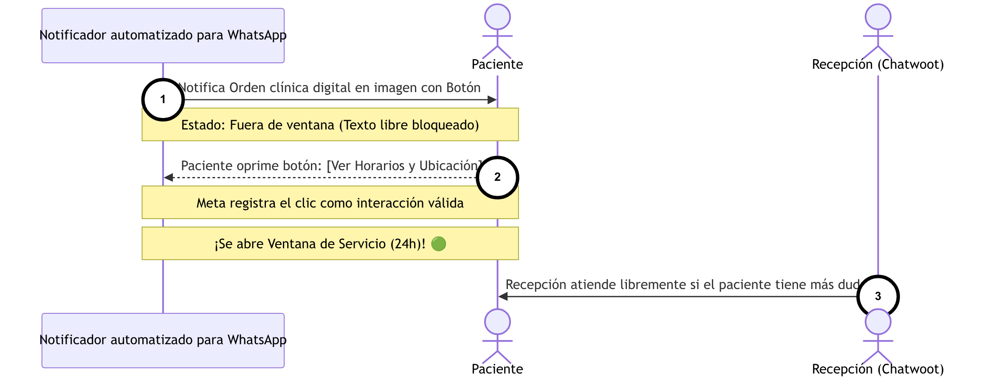
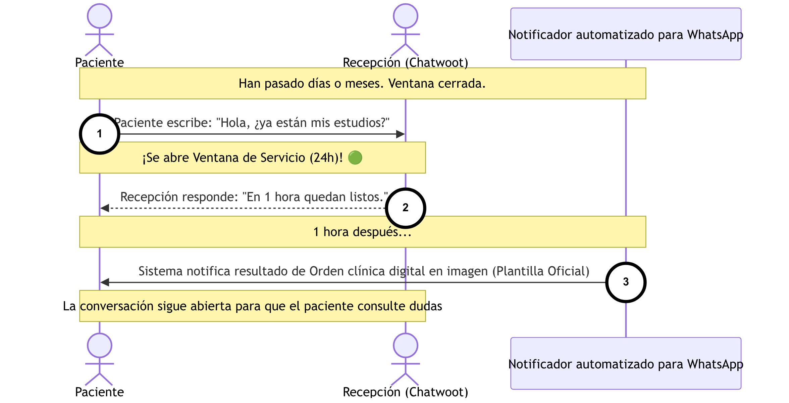

  <h1>ANEXO VISUAL: Flujo Operativo y Secuencia (Opción 4)</h1>
  <h3>Diagrama 1: Emisión de la Orden y Atracción</h3>
  
  
     
  

    
<strong>Contexto:</strong> Este diagrama expresa el flujo inicial de captación. Ilustra cómo el Médico Tratante emite la orden de estudios y cómo interactúa el sistema en la nube para procesarla y hacerle llegar al Paciente su Orden clínica digital en imagen por WhatsApp, atrayéndolo hacia el laboratorio.

    <table style="width: 100%; border-collapse: collapse; font-family: Arial, sans-serif; font-size: 14px;">
      <tr>
        <td style="width: 50%; vertical-align: top; padding: 10px; border: 1px solid #ddd;">
          <strong>📖 Instrucciones de Lectura</strong>  
          • El diagrama se lee cronológicamente de arriba hacia abajo, siguiendo los pasos numerados (1, 2, 3...). 
          • Las líneas sólidas representan envíos de información. 
          • Las líneas punteadas representan confirmaciones del sistema.
        </td>
        <td style="width: 50%; vertical-align: top; padding: 10px; border: 1px solid #ddd;">
          <strong>💎 Puntos de Valor del Flujo</strong>  
          • <strong>Menos Errores:</strong> Mitiga la mala letra en recetas de papel. 
          • <strong>Atracción:</strong> El paciente recibe una solicitud formal con la marca del laboratorio en su celular. 
          • <strong>Trazabilidad:</strong> Genera un Folio único desde el primer instante.
        </td>
      </tr>
    </table>
  

  <h3>Diagrama 2: Operación en Recepción</h3>
  
  
     
  

    
<strong>Contexto:</strong> Este diagrama muestra la llegada del paciente a la clínica y la interacción física en mostrador. Describe cómo el personal de Recepción localiza la orden (previamente capturada por el médico tratante) para agilizar la toma de muestras y el cobro.

    <table style="width: 100%; border-collapse: collapse; font-family: Arial, sans-serif; font-size: 14px;">
      <tr>
        <td style="width: 50%; vertical-align: top; padding: 10px; border: 1px solid #ddd;">
          <strong>📖 Instrucciones de Lectura</strong>  
          • Siga la numeración del 1 al 4, de arriba hacia abajo. 
          • Identifique al Paciente entregando la solicitud y a la Recepcionista validando el Folio en el sistema. 
          • Observe cómo Recepción hace el puente de datos hacia el Laboratorio.
        </td>
        <td style="width: 50%; vertical-align: top; padding: 10px; border: 1px solid #ddd;">
          <strong>💎 Puntos de Valor del Flujo</strong>  
          • <strong>Velocidad en Mostrador:</strong> Evita volver a teclear todos los estudios del paciente; todo ya viene pre-cargado. 
          • <strong>Fluidez Operativa:</strong> Transición transparente hacia su software de caja/LIS existente. 
          • <strong>Información al Médico:</strong> El médico tratante sabe al instante que su paciente ya llegó a la clínica.
        </td>
      </tr>
    </table>
  

  <h3 style="margin-top: 0; padding-top: 0;">Diagrama 3: Automatización y Entrega de Resultados</h3>
  
    
  

    
<strong>Contexto:</strong> Este diagrama ilustra el potente ciclo de salida de los resultados y el modelo omnicanal híbrido. Expone cómo el Químico deposita el PDF final y cómo el Notificador automatizado para WhatsApp lo lee y distribuye instantáneamente al portal web y al celular del paciente.

    <table style="width: 100%; border-collapse: collapse; font-family: Arial, sans-serif; font-size: 14px;">
      <tr>
        <td style="width: 50%; vertical-align: top; padding: 10px; border: 1px solid #ddd;">
          <strong>📖 Instrucciones de Lectura</strong>  
          • Siga los pasos numerados de arriba hacia abajo y de izquierda a derecha. 
          • Note cómo el Sistema Bloc Digital funge como orquestador central (pasos 4, 5, 6 y 7). 
          • Observe al actor "Recepcionista (Chatwoot / WhatsApp Web)" atendiendo las respuestas manuales.
        </td>
        <td style="width: 50%; vertical-align: top; padding: 10px; border: 1px solid #ddd;">
          <strong>💎 Puntos de Valor del Flujo</strong>  
          • <strong>Automatización Total:</strong> La recepcionista ya no necesita adjuntar manualmente PDFs ni enviar mensajes a los pacientes. 
          • <strong>Omnicanalidad:</strong> Si el paciente tiene una duda, responde al mismo chat y la recepcionista le atiende con el calor humano de siempre. 
          • <strong>Accesibilidad Remota:</strong> Portal histórico disponible 24/7.
        </td>
      </tr>
    </table>
  

  <h1>ANEXO VISUAL: Casos de Uso de la Bandeja Omnicanal (Reglas de Meta)</h1>
  

    Los siguientes diagramas ilustran cómo operan las políticas Anti-Spam de Meta (Regla de la Ventana de 24 horas). El Notificador automatizado para WhatsApp puede enviar <strong>notificaciones (plantillas)</strong> en cualquier momento, pero el personal humano (Recepción) solo puede responder con <strong>texto libre</strong> si el paciente realiza una interacción (abre la ventana).
  

  <h3>Flujo 1: Interacción por Consulta Directa</h3>
  
  
  

    
<strong>Contexto:</strong> Este diagrama ilustra cómo el paciente, al tener una duda, inicia de forma orgánica una conversación, lo que permite a Recepción atenderle libremente gracias a la apertura de la ventana de 24 horas.

    <table style="width: 100%; border-collapse: collapse; font-family: Arial, sans-serif; font-size: 14px;">
      <tr>
        <td style="width: 50%; vertical-align: top; padding: 10px; border: 1px solid #ddd;">
          <strong>📖 Instrucciones de Lectura</strong>  
          • Siga la cronología de arriba hacia abajo (pasos 1 a 4). 
          • La nota verde (🟢) indica el momento exacto en que las reglas de Meta permiten el texto libre. 
          • Observe cómo la recepcionista puede enviar promociones y audios solo después de esa apertura.
        </td>
        <td style="width: 50%; vertical-align: top; padding: 10px; border: 1px solid #ddd;">
          <strong>💎 Puntos de Valor del Flujo</strong>  
          • <strong>Atención Orgánica:</strong> El paciente no percibe un bot rígido; recibe ayuda humana cuando la necesita. 
          • <strong>Ventana Extendida:</strong> Se cuenta con 24 horas para resolver cualquier incidencia sin costo adicional en envíos.
        </td>
      </tr>
    </table>
  

  <h3>Flujo 2: Interacción por Botón de Acción (Mitigación)</h3>
  
  
  

    
<strong>Contexto:</strong> Ante las políticas anti-spam, este diagrama muestra una táctica de mitigación usando un "Botón Mágico" en la plantilla. Si el paciente toca el botón por curiosidad, Meta lo registra como interacción, liberando el chat.

    <table style="width: 100%; border-collapse: collapse; font-family: Arial, sans-serif; font-size: 14px;">
      <tr>
        <td style="width: 50%; vertical-align: top; padding: 10px; border: 1px solid #ddd;">
          <strong>📖 Instrucciones de Lectura</strong>  
          • Identifique el primer envío (1) que contiene el botón. 
          • Vea el paso (2) donde la simple acción de oprimir el botón detona la nota verde (🟢). 
          • Esto habilita el paso (3) para atención humana.
        </td>
        <td style="width: 50%; vertical-align: top; padding: 10px; border: 1px solid #ddd;">
          <strong>💎 Puntos de Valor del Flujo</strong>  
          • <strong>Desbloqueo Estratégico:</strong> Permite "enganchar" al paciente para que inicie la conversación. 
          • <strong>Protección:</strong> Previene que la clínica intente enviar texto libre y sea bloqueada por el sistema.
        </td>
      </tr>
    </table>
  

  <h3>Flujo 3: Interacción por Seguimiento (Paciente Inicia)</h3>
  
  
  

    
<strong>Contexto:</strong> Este caso de uso refleja a un paciente que, días o incluso meses después de haber asistido a la clínica (y con la ventana ya cerrada), escribe por iniciativa propia para reclamar o preguntar. Esta acción revive la conversación y permite a la recepcionista atenderle desde Chatwoot.

    <table style="width: 100%; border-collapse: collapse; font-family: Arial, sans-serif; font-size: 14px;">
      <tr>
        <td style="width: 50%; vertical-align: top; padding: 10px; border: 1px solid #ddd;">
          <strong>📖 Instrucciones de Lectura</strong>  
          • Observe el paso (1) donde el paciente rompe el silencio tras días o meses. 
          • Esto abre inmediatamente la ventana de servicio (🟢) para que la recepcionista opere desde Chatwoot. 
          • Note que el Notificador automatizado (paso 3) puede enviar la plantilla oficial independiente del estado de la ventana.
        </td>
        <td style="width: 50%; vertical-align: top; padding: 10px; border: 1px solid #ddd;">
          <strong>💎 Puntos de Valor del Flujo</strong>  
          • <strong>Flexibilidad Asíncrona:</strong> El paciente siempre tiene la línea abierta para hacer exigencias. 
          • <strong>Sin Fricción:</strong> Las respuestas de Recepción (2) se intercalan perfectamente con las notificaciones del Sistema (3).
        </td>
      </tr>
    </table>
  

