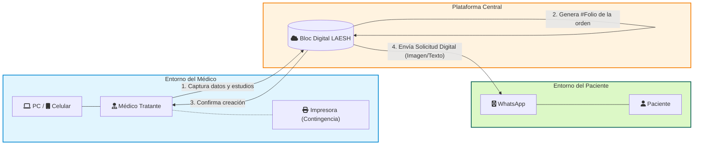
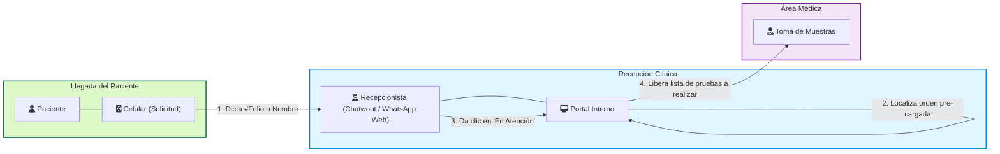
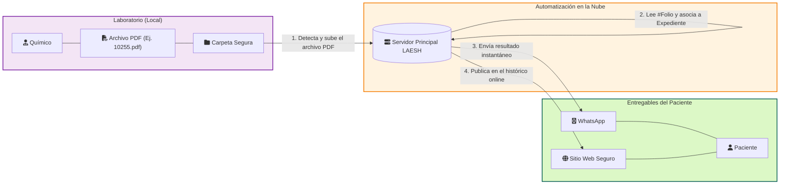

# Diagramas de Flujo (FontAwesome y Subgrafos)

### Diagrama 1: Emisión de la Orden

```mermaid
flowchart LR
    subgraph EntornoMedico ["Entorno del Médico"]
        direction TB
        DISP["fa:fa-laptop PC / fa:fa-mobile Celular"]
        M["fa:fa-user-md Médico Tratante"]
        IMP["fa:fa-print Impresora (Contingencia)"]
        
        DISP --- M
        M -.- IMP
    end
    
    subgraph Nube ["Plataforma Central"]
        S[(fa:fa-cloud Bloc Digital LAESH)]
    end
    
    subgraph EntornoPaciente ["Entorno del Paciente"]
        direction TB
        WA["fa:fa-whatsapp WhatsApp"]
        P["fa:fa-user Paciente"]
        
        WA --- P
    end

    M -- "1. Captura datos y estudios" --> S
    S -- "2. Genera #Folio de la orden" --> S
    S -- "3. Confirma creación" --> M
    S -- "4. Envía Solicitud Digital (Imagen/Texto)" --> WA
    
    style EntornoMedico fill:#e1f5fe,stroke:#0288d1,stroke-width:2px
    style EntornoPaciente fill:#dcf8c6,stroke:#075e54,stroke-width:2px
    style Nube fill:#fff3e0,stroke:#f57c00,stroke-width:2px
```

### Diagrama 2: Operación en Recepción

```mermaid
flowchart LR
    subgraph EntornoPaciente ["Llegada del Paciente"]
        P["fa:fa-user Paciente"]
        WA["fa:fa-whatsapp Celular (Solicitud)"]
        P --- WA
    end

    subgraph EntornoClinica ["Recepción Clínica"]
        direction TB
        REC["fa:fa-user-nurse Recepcionista (Chatwoot / WhatsApp Web)"]
        PC["fa:fa-desktop Portal Interno"]
        REC --- PC
    end
    
    subgraph EntornoLab ["Área Médica"]
        Q["fa:fa-user-md Toma de Muestras"]
    end

    WA -- "1. Dicta #Folio o Nombre" --> REC
    PC -- "2. Localiza orden pre-cargada" --> PC
    REC -- "3. Da clic en 'En Atención'" --> PC
    PC -- "4. Libera lista de pruebas a realizar" --> Q
    
    style EntornoPaciente fill:#dcf8c6,stroke:#075e54,stroke-width:2px
    style EntornoClinica fill:#e1f5fe,stroke:#0288d1,stroke-width:2px
    style EntornoLab fill:#f3e5f5,stroke:#7b1fa2,stroke-width:2px
```

### Diagrama 3: Entrega Automatizada de Resultados

```mermaid
flowchart LR
    subgraph EntornoLab ["Laboratorio (Local)"]
        direction TB
        Q["fa:fa-user-md Químico"]
        PDF["fa:fa-file-pdf Archivo PDF (Ej. 10255.pdf)"]
        SYNC["fa:fa-folder Carpeta Segura"]
        
        Q --- PDF
        PDF --- SYNC
    end

    subgraph Nube ["Automatización en la Nube"]
        S[(fa:fa-server Servidor Principal LAESH)]
    end

    subgraph EntornoPaciente ["Entregables del Paciente"]
        direction TB
        WA["fa:fa-whatsapp WhatsApp"]
        WEB["fa:fa-globe Sitio Web Seguro"]
        P["fa:fa-user Paciente"]
        
        WA --- P
        WEB --- P
    end

    SYNC -- "1. Detecta y sube el archivo PDF" --> S
    S -- "2. Lee #Folio y asocia a Expediente" --> S
    S -- "3. Envía resultado instantáneo" --> WA
    S -- "4. Publica en el histórico online" --> WEB
    
    style EntornoLab fill:#f3e5f5,stroke:#7b1fa2,stroke-width:2px
    style Nube fill:#fff3e0,stroke:#f57c00,stroke-width:2px
    style EntornoPaciente fill:#dcf8c6,stroke:#075e54,stroke-width:2px
```
