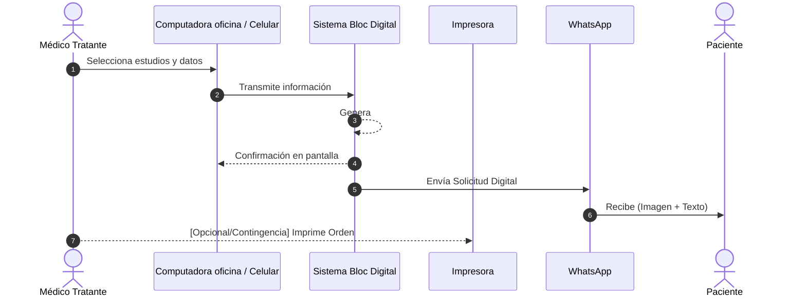
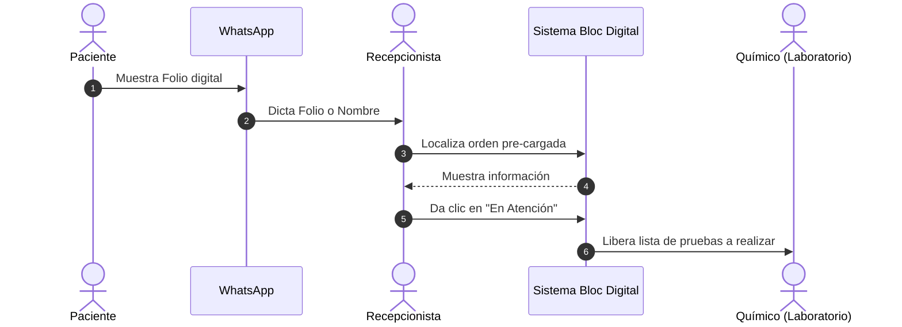
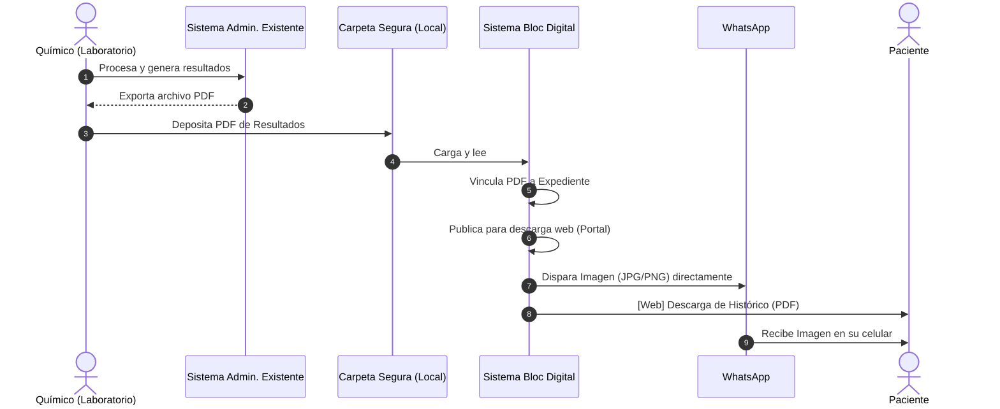

# Diagramas de Secuencia (Monitos y Homologación de Términos)

### Diagrama 1: Emisión de la Orden y Atracción

### Diagrama 2: Operación en Recepción (Cero errores)

### Diagrama 3: Automatización y Entrega de Resultados

