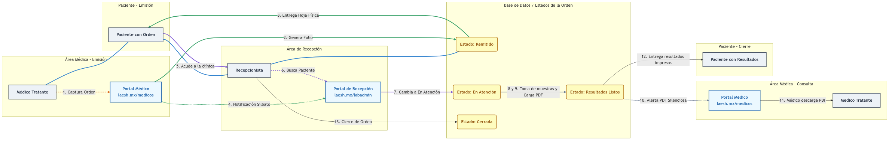

  <h1>ANEXO VISUAL: Flujo Operativo y Secuencia — Proyecto 2: Bloc Digital via Internet</h1>

  

    <strong>📌 Nota de Aplicabilidad:</strong> Los flujos descritos en este documento corresponden íntegramente al <strong>Proyecto 2 — Bloc Digital via Internet</strong>. Este ecosistema opera de forma 100% web y privada a través de los dominios correspondientes, garantizando la interacción interna directa entre el Médico Tratante y Recepción mediante notificaciones nativas en navegador, sin dependencias de servicios externos ni mensajería de terceros.
  

  <h3>Diagrama de Flujo Operativo y Ciclo de Vida de la Orden</h3>
  
  
    
  

    
<strong>Contexto:</strong> Este diagrama representa de forma sencilla y secuencial los numerales de la sección 3 (Flujo Operativo) del Resumen de la Oferta. Ilustra las interacciones de los actores (Médico Tratante, Paciente, Recepcionista), los portales web utilizados y las transiciones del estado de la orden digital desde su captura hasta el cierre final.

    <table style="width: 100%; border-collapse: collapse; font-family: Arial, sans-serif; font-size: 14px;">
      <tr>
        <td style="width: 50%; vertical-align: top; padding: 10px; border: 1px solid #ddd;">
          <strong>📖 Instrucciones de Lectura</strong>  
          • Siga el flujo numerado (1 al 13) para recorrer cronológicamente el ciclo de vida de una orden digital. 
          • Las líneas sólidas representan acciones e interacciones directas de los actores. 
          • Las líneas punteadas representan notificaciones automáticas y alertas enviadas por el sistema. 
          • Los recuadros amarillos representan los 4 estados oficiales del expediente en la base de datos.
        </td>
        <td style="width: 50%; vertical-align: top; padding: 10px; border: 1px solid #ddd;">
          <strong>💎 Puntos de Valor de la Solución</strong>  
          • <strong>Prevención de Errores:</strong> Captura legible y directa de estudios por el médico tratante (1). 
          • <strong>Atención Agilizada:</strong> Recepción recibe notificaciones en tiempo real con sonido de silbato y enlace al expediente (4), localizando al paciente en mostrador al instante por folio o autocompletado (6). 
          • <strong>Seguimiento Transparente:</strong> El médico es notificado silenciosamente en su portal cuando los resultados en PDF están disponibles (10), permitiendo su descarga inmediata (11).
        </td>
      </tr>
    </table>
  

