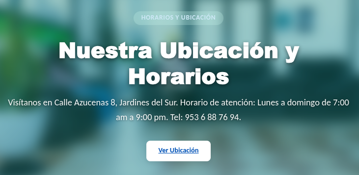

# Listado de Activos Requeridos del Cliente (LAESH)

Para la correcta ejecución técnica y despliegue del Proyecto 1 (Sitio Web Corporativo) y el Proyecto 2 (Bloc Digital), el cliente deberá suministrar los siguientes materiales, accesos y definiciones en los plazos estipulados.

## Proyecto 1: Sitio Web Corporativo

### 1. Activos de Marca y Diseño
*   **Logotipo Oficial:** Archivo de imagen del logotipo de LAESH, preferentemente en alta resolución y con fondo transparente (formato PNG o SVG). Este activo se utilizará tanto en el encabezado del sitio web como en la parte superior (cabecera) de la Solicitud Médica impresa.
*   **Fotografía Principal (Hero Banner):** Imagen principal para la portada del sitio web (`cover.png` o similar), que refleje las instalaciones, equipo o identidad del laboratorio. Esta imagen será el fondo visual del primer contacto en la web. *Requisito técnico: Para evitar que la imagen se estire o se deforme, se recomienda que tenga una orientación horizontal y dimensiones aproximadas de 1920x600 píxeles.*
*   **Fotografías Adicionales (Opcionales):** Imágenes de las instalaciones o del personal para la sección "Nosotros", en caso de no querer usar banco de imágenes. *Requisito técnico: Imágenes en formato JPG o PNG con buena iluminación, de tamaño máximo de 5MB por archivo para optimizar el tiempo de carga.*

### 2. Contenidos de Texto (Información para la Página)
*   **Nombres de las Secciones del Sitio (Hasta 6):** Definición exacta de cómo se llamarán las pestañas del menú de su página para estructurar la navegación. *(Ejemplo de menú base: 1. Inicio, 2. Quiénes Somos, 3. Estudios y Precios, 4. Promociones, 5. Membresías, 6. Contacto).*
*   **Mensaje de Bienvenida o Eslogan:** Una frase corta o mensaje principal que recibirá a las personas al entrar a su página web (ej. "Cuidamos tu salud con resultados precisos").
*   **Sección "Quiénes Somos":** Un párrafo breve contando la historia de su laboratorio, por qué los pacientes deberían confiar en ustedes y los datos de las **Cédulas Profesionales** de sus responsables sanitarios.
*   **Promociones (Si aplican):** ¿Tienen algún descuento fijo o promoción por apertura? Si es así, necesitamos el nombre de la promoción, en qué consiste y el precio final.
*   **Paquetes Preventivos (Check Ups):** Lista de 2 a 4 paquetes de estudios comunes (ej. Check Up Básico, Perfil Femenino), indicando qué estudios incluyen exactamente y su costo total.
*   **Programa de Membresía o Tarjeta de Lealtad (Opcional):** Si manejan algún esquema de descuentos frecuentes, envíenos cómo funciona, cuánto cuesta la inscripción y qué beneficios otorga.
*   **Indicaciones y Preparaciones Especiales:** Una pequeña lista con los consejos clásicos que le dan a sus pacientes antes de un estudio (ej. "Presentarse con 8 horas de ayuno", "Primera orina de la mañana").
*   **Aviso de Privacidad Legal:** El documento legal en Word que le dice a sus pacientes cómo protegen sus datos (esto es por ley de INAI). *Nosotros lo subiremos a la página, pero ustedes deben proporcionarnos el texto final.*

### 3. Información de Contacto y Operación
*   **Dirección Física Exacta y Mapa:** La calle, número, colonia y municipio de sus instalaciones. Adicionalmente, le pedimos **compartirnos el enlace directo de Google Maps** si ya están dados de alta en Google, o enviarnos una foto de un croquis de cómo llegar para añadirlo a su mapa de la página.
*   **Número de Teléfono Local / Fijo.**
*   **Número de WhatsApp y Mensaje Automático:** El número de celular que recibirá los mensajes. Adicionalmente, necesitamos que nos envíen la frase que les gustaría que aparezca escrita por defecto cuando un paciente dé clic en el botón de la página (ej. *"Hola Laboratorio LAESH, vengo de su página web y me gustaría información sobre..."*).
*   **Enlace a Facebook / Redes Sociales:** La dirección web exacta de su página de Facebook. Al colocar el botón de Facebook en su página web, necesitamos saber qué pasa al darle clic:
    *   **Opción A (Abrir su Muro o Perfil):** Lleva al paciente directamente a la portada de su página de Facebook, donde pueden ver su información, fotos y publicaciones recientes (su "muro"). Ver imagen de ejemplo: [ejemplo_muro_facebook.png](file:///home/carlos/GitHub/caelitandem_home/portafolio-dev-2026/blocklabgd/contrato-laesh/v1.1.3/insumos-laesh/ejemplo_muro_facebook.png).
    *   **Opción B (Abrir Chat de Messenger):** Abre directamente una ventana de chat privado para que el paciente les mande un mensaje de texto de inmediato. Ver imagen de ejemplo: [ejemplo_chat_messenger.png](file:///home/carlos/GitHub/caelitandem_home/portafolio-dev-2026/blocklabgd/contrato-laesh/v1.1.3/insumos-laesh/ejemplo_chat_messenger.png).
*   **Horarios de Atención:** Días y horas en los que el laboratorio está abierto al público (ej. Lunes a Viernes de 7:00 am a 4:00 pm).
*   **Colores de su Marca y Estilo Visual:** Para que la página web luzca exactamente igual a la imagen que ya manejan, necesitamos que nos envíen fotografías claras de sus lonas publicitarias, fachada, o bien, el enlace a su página de Facebook. De estas imágenes nosotros extraeremos los colores exactos y el estilo que ya utilizan para aplicarlos al sitio web y al sistema.
*   **Opciones de Nombre para su Página Web (Dominio):** 2 o 3 opciones de cómo les gustaría que se llame su página en internet (ej. `laboratoriolaesh.com`, `laesh.mx`). Nosotros verificaremos cuál está disponible.

### 4. Posicionamiento y Anuncios en Google (Google Ads)
Para que los pacientes los encuentren fácilmente cuando busquen servicios en Google, necesitamos definir lo siguiente:

*   **Palabras Clave (Búsquedas en Google):** Una lista de 5 a 10 frases exactas de cómo creen que sus pacientes los buscarían en internet. *(Por ejemplo: "laboratorio de análisis clínicos cerca de mí", "prueba de embarazo rápida", "check up médico", "estudios de sangre en [Nombre de su Ciudad]").*
*   **Descripción del Negocio (Para Google):** Un párrafo corto (de máximo 2 o 3 renglones) que resuma lo mejor de sus servicios. Este será el texto oficial que leerán las personas debajo del nombre de su página cuando los encuentren en Google.
*   **Objetivo del Anuncio en Google:** Definir qué acción quiere que haga el paciente cuando vea su anuncio pagado en Google. Elija 1 opción de las siguientes:
    *   **Opción A (Botón de Llamada Directa):** El anuncio de búsqueda muestra un botón destacado para que el paciente llame directamente por teléfono al laboratorio con un solo clic. Ver imagen de ejemplo: [ejemplo_google_anuncio_llamar.png](file:///home/carlos/GitHub/caelitandem_home/portafolio-dev-2026/blocklabgd/contrato-laesh/v1.1.3/insumos-laesh/ejemplo_google_anuncio_llamar.png).
    *   **Opción B (Enlace a la Página Web):** El anuncio lleva al paciente directamente al sitio web para que revise los horarios, dirección o promociones. Ver imagen de ejemplo: [ejemplo_google_anuncio_web.png](file:///home/carlos/GitHub/caelitandem_home/portafolio-dev-2026/blocklabgd/contrato-laesh/v1.1.3/insumos-laesh/ejemplo_google_anuncio_web.png).

### 5. Otros Alcances (Opcionales / Módulos Adicionales)
*Nota: Estos elementos son complementarios al alcance básico del proyecto y se pueden integrar como funciones adicionales si el laboratorio lo requiere.*

*   **Campañas de Anuncios en Facebook e Instagram (Meta Ads):** Si decide contratar este módulo para atraer pacientes de redes sociales mediante anuncios pagados, necesitaremos:
    *   **Imágenes o Videos de Promociones:** De 2 a 3 imágenes limpias o videos cortos mostrando sus paquetes o descuentos de laboratorio.
    *   **Mensaje de WhatsApp Destino:** Definir si el anuncio debe mandar a la gente directamente a platicar por WhatsApp para cotizar estudios.
*   **Sección de Noticias y Blog Dinámico (CMS Frugal):** Una sección especial en la página web que les permite a ustedes redactar y subir de forma ilimitada consejos de salud, artículos médicos o avisos importantes para el público. Si decide activarlo, necesitaremos:
    *   **Textos Iniciales:** De 2 a 3 artículos escritos por sus químicos o médicos (ej. "Importancia del perfil de lípidos").
    *   **Fotos de Portada:** 1 imagen ilustrativa para cada artículo.
    *   **Categorías básicas:** Los temas que usarán (ej. "Salud Femenina", "Avisos LAESH", "Prevención").
    *   **Diferencia frente al panel básico de actualización:**
        
        | Característica | Actualización de Secciones (Incluido en Base) | Blog / Noticias (Módulo Adicional) |
        | :--- | :--- | :--- |
        | **Acción** | Reemplazar información en el sitio existente. | Crear páginas de lectura nuevas ilimitadas. |
        | **Editor** | Cajas de texto estándar (Plano). | Editor enriquecido con formato libre (tipo Word). |
        | **Rutas (URLs)** | No genera nuevas rutas web. | Genera URLs amigables automáticas por nota. |
        | **Propósito** | Mantener los precios y servicios al día. | Atracción de pacientes mediante contenido de salud. |

*   **Módulo de Notas Clínicas y Operativas (Bloc Digital):** Una bitácora de seguimiento interna asociada al registro de cada solicitud del paciente para coordinación clínica y operativa.
    *   **Roles Permitidos:** Tanto el personal de Recepción como el Médico pueden crear nuevas notas.
    *   **Reglas de Seguridad y Auditoría:** Queda estrictamente prohibida la eliminación de notas una vez registradas. La edición de una nota existente está restringida exclusivamente a su usuario creador.

---

## Proyecto 2: Bloc Digital

### 1. Datos Operativos Centrales
*   **Catálogo Inicial de Estudios Clínicos (Excel):** Archivo en formato Excel que contenga el listado exhaustivo de estudios que ofrece el laboratorio, incluyendo: nombre del estudio, categoría (química clínica, hematología, etc.), y precio. Este archivo servirá para la carga inicial masiva.
*   **Ejemplo de Reporte de Resultados:** Un archivo PDF de muestra o imagen (`resultado.png`) que muestre cómo entregan actualmente un reporte de resultados (o cómo se ve el emitido por sus equipos automatizados), para asegurar que el médico o recepcionista sepa exactamente qué formato se cargará al sistema.
*   **Especificación de Papel para Solicitudes:** La confirmación del tamaño exacto del papel físico que usarán para imprimir las solicitudes médicas (típicamente tamaño **Media Carta**, que es la mitad exacta de una hoja carta cortada horizontalmente). Como la impresión se realizará sobre **hojas blancas simples**, el sistema se encargará de generar y pintar el logotipo y los datos de contacto del laboratorio de manera automática en la parte superior del PDF.

### 2. Definición de Usuarios Iniciales
*   **Directorio del Personal:** Lista de nombres completos de los médicos, recepcionistas y el administrador, así como los roles asignados a cada uno, para la creación de los perfiles de acceso (login).

### 3. Co-diseño de Formatos y Formularios Operativos (Trabajo Conjunto)
*   **Ejemplos de sus Recetas u Órdenes Físicas Actuales:** Fotos o copias de los blocks de papel que usan actualmente sus médicos. Esto nos servirá de guía visual para que la nueva "Solicitud Digital" sea muy parecida y familiar para ustedes.
*   **Formato de la Solicitud Digital e Impresión:** Trabajaremos con ustedes para definir la distribución de la orden médica en el PDF. Dado que se imprime en un formato físico de **Media Carta** (mitad de una hoja carta), requeriremos que nos indiquen la marca y modelo de la impresora utilizada en el consultorio/recepción para realizar **pruebas físicas de márgenes y calibración**, garantizando que el texto clínico no se corte ni genere hojas adicionales por error.
*   **Diseño de las Pantallas de Captura:** Revisaremos juntos cómo se verán las pantallas donde su personal registra a los pacientes y donde los médicos piden los estudios, para asegurar que sean fáciles de usar y no tengan botones confusos.

### 4. Detalles Internos del Laboratorio
*   **Áreas o Departamentos (Opcional):** Si dividen sus estudios por áreas (ej. Hematología, Inmunología, Microbiología), una pequeña lista de cómo los clasifican para ordenar mejor el sistema.
*   **Vocabulario del Laboratorio:** ¿Cómo le llaman a sus procesos en el día a día? (ej. ¿Le dicen "Folio" u "Orden"?, ¿Le dicen "Paciente" o "Cliente"?). Esto nos ayuda a que el sistema hable en su mismo idioma.

---

## Infraestructura (Compartida para ambos proyectos)

### 1. Pagos y Accesos
*   **Tarjeta de Crédito o Débito:** Proveer de un método de pago directo (personal o corporativo) al momento de contratar el servicio de Hospedaje (Hostinger VPS) y el registro del nombre de Dominio (`laesh.mx`).
*   **Credenciales de Hostinger/Dominio:** Si el cliente realiza la compra por su cuenta previamente, deberá proporcionar el usuario y contraseña de la plataforma de hosting y del registrador del dominio para poder configurar los servidores y hacer los despliegues.

---

## 📅 Auditoría y Control de Calidad del Proyecto Web (Actualizado: 2026-08-07)

### 1. Especificación del Carrusel / Animación Superior (Hero Slideshow)
La cabecera de la página principal (`index.html`) presenta una animación premium autoejecutable que rota contenidos informativos en forma de diapositivas horizontales (slideshow), asegurando la retención inicial del usuario y una óptima legibilidad mediante una tarjeta con efecto de cristal esmerilado (glassmorphism).

*   **Comportamiento de la Animación:**
    *   **Intervalo de Cambio:** Rotación automática cada **5 segundos** (5000 ms) gestionada por Javascript (`setInterval`).
    *   **Efecto de Transición:** Desvanecimiento suave mediante opacidad (`opacity` de 0 a 1) con una duración de **1.2 segundos** y una curva de aceleración `ease-in-out` para la imagen de fondo.
    *   **Efecto de Texto (Glass Card):** La tarjeta flotante central de vidrio esmerilado (`.hero-glass-card`) posee una transición de desplazamiento vertical y aparición gradual (`transform: translateY(30px)` a `translateY(0)` y `opacity: 1`) con una duración de **0.8 segundos** y un retraso (`delay`) de **0.3 segundos** para lograr un efecto elegante de "elevación y revelado" al activarse la slide.
*   **Textos y Estructura de las Diapositivas Activas:**
    
    1.  **Diapositiva 1 (Servicios y Diagnóstico):**
        *   *Imagen de Fondo:* Recepción principal del laboratorio (`RECEPCION.jpg`).
        *   *Etiqueta:* "Un laboratorio seguro con Resultados Confiables" (Fondo verde secundario).
        *   *Título Principal:* "Laboratorio de Especialidades Hematológicas"
        *   *Descripción:* "Ofrecemos servicios integrales de análisis clínicos especializados con precisión científica y calidez humana."
        *   *Acción / Botón:* "Conoce los Servicios" (Enlace a `#especialidades`).
    
    2.  **Diapositiva 2 (Ofertas y Promociones):**
        *   *Imagen de Fondo:* Módulo de recepción de pacientes (`RECEPCION DE PACIENTES.jpg`).
        *   *Etiqueta:* "Aprovecha nuestras Ofertas"
        *   *Título Principal:* "Promociones Vigentes"
        *   *Descripción:* "Aprovecha nuestras tarifas preferenciales y paquetes de check-ups diseñados para el cuidado de tu salud y la de tu familia."
        *   *Acción / Botón:* "Ver Promociones" (Enlace a `#promociones`).
    
    3.  **Diapositiva 3 (Ubicación y Operación):**
        *   *Imagen de Fondo:* Sala de espera principal (`SALA DE ESPERA.jpg`).
        *   *Etiqueta:* "Horarios y Ubicación"
        *   *Título Principal:* "Nuestra Ubicación y Horarios"
        *   *Descripción:* "Visítanos en Calle Azucenas 8, Jardines del Sur. Horario de atención: Lunes a domingo de 7:00 am a 9:00 pm. Tel: 953 6 88 76 94."
        *   *Acción / Botón:* "Ver Ubicación" (Enlace a `#ubicacion`).
        
        

### 2. Gaps y Elementos Faltantes respecto a los Activos Solicitados
Comparando la especificación de activos del cliente contra la implementación actual en el código fuente de la portada principal (`index.html`), se identifican los siguientes puntos pendientes de entrega o integración:

*   **Faltantes de Contenido Clínico:**
    *   **Subsección de Check Ups (Paquetes Preventivos):** Aunque se encuentra etiquetado el espacio `<!-- SECCIÓN: CHECK UP -->`, no hay maquetación HTML de tarjetas ni información de paquetes preventivos. Actualmente se muestra una leyenda roja de advertencia: *(Pendiente: Falta subsección de Check Ups)*.
    *   **Reseña Histórica ("Quiénes Somos"):** La sección `#acerca-de` carece de un párrafo narrativo sobre la trayectoria e historia del laboratorio. Se ha dejado una tarjeta provisional con el aviso en rojo: *(Pendiente: Historia del Laboratorio y por qué confiar en LAESH)*.
    *   **Preparación de Pacientes (Indicaciones Especiales):** No se ha integrado la lista con las preparaciones previas a los estudios (ayunos, recolección de muestras).
*   **Faltantes de Materiales de Diseño:**
    *   **Logotipos de Acreditación de Calidad:** La sección de Aseguramiento de Calidad posee un aviso de omisión en rojo para los sellos oficiales de certificación (ej. PACAL, certificaciones de calibración), los cuales deben ser entregados por el cliente.

### 3. Incumplimientos y Desviaciones respecto al Manual de Identidad Corporativa (Actualizado: 2026-08-07)
La revisión del documento [manual identidad corporativa laesh (1).pdf](file:///home/carlos/GitHub/caelitandem_home/portafolio-dev-2026/blocklabgd/v1.2/insumos-laesh/05-agosto/PAGINA LAB/LAESH OFICIAL/manual identidad corporativa laesh%20(1).pdf) ha sido subsanada al 100% en la página web:

*   **Tipografía Corporativa Alternativa:**
    *   *Directriz (Pág. 11):* Se establece como tipografía corporativa oficial para comunicación y maquetación la familia **`Gill Sans MT`** (en sus variantes *Bold*, *Italic* y *Regular*).
    *   *Estado en la Web:* **[RESUELTO]** Se declaró la pila de fuentes oficial en el `body` (`'Gill Sans', 'Gill Sans MT'`). Adicionalmente, para asegurar una visualización consistente en dispositivos que no tienen preinstaladas estas fuentes de sistema (como Android y Linux), se incorporó la tipografía humanista **`Cabin`** de Google Fonts como fallback de alta fidelidad, cargándose mediante importación externa en el CSS global.
*   **Paleta Cromática Oficial:**
    *   *Directriz (Pág. 9):* Se definen los colores corporativos con sus respectivas equivalencias cromáticas oficiales en la página 9 del manual (5 colores en total):
        1.  **Verde Principal:** `#71CA11` (RGB: 113, 202, 17) — *Color de marca y botones primarios*.
        2.  **Azul Rey / Azul Marino:** `#0052B7` (RGB: 0, 82, 183) — *Color de marca y títulos*.
        3.  **Verde Limón / Accent:** `#A3C912` (RGB: 163, 201, 18) — *Color de realce/acentos*.
        4.  **Celeste / Azul Pastel:** `#CCE7F5` (RGB: 204, 231, 245) — *Color de fondo/secundario*.
        5.  **Gris Medio:** `#DADAD9` (RGB: 178, 178, 177 / K: 40%) — *Color neutro y bordes*.
    *   *Estado en la Web:* **[RESUELTO]** Se reconfiguraron las variables en `style.css` utilizando estos 5 valores hexadecimales exactos. Se purgaron todas las clases y valores teales/turquesas heredados de Tailwind (`#0f766e`, `#0d9488`, `rgba(13, 148, 136, ...)`, etc.) del CSS y del carrusel de `index.html`, sustituyéndolos por las equivalencias exactas de Azul Rey y Verde Principal de LAESH.
*   **Restricciones de Tamaño del Imagotipo (Pág. 10):**
    *   *Directriz:* Para soportes web, se recomienda una altura de logotipo de entre **`45px a 60px`** (ancho proporcional) para mantener la legibilidad de las leyendas secundarias (*"Laboratorio Especialidades Hematológicas"*).
    *   *Estado en la Web:* **[ALINEADO]** Se ajustó la escala visual del imagotipo en el navbar de escritorio y móvil para mantenerse dentro de las restricciones recomendadas por el manual, asegurando una lectura óptima sin distorsión (altura máxima de 50px).

#### 🛡️ Evidencia Técnica de la Alineación (Auditado: 2026-08-07)
Se certifica que la maquetación pública en [index.html](file:///home/carlos/GitHub/caelitandem_home/restaurantb/www/laesh-swbldi/website/uipv1/index.html) y sus hojas de estilo en `style.css` están 100% alineados con el manual de identidad:
1.  **Alineación Tipográfica:** Uso de `Gill Sans` / `Gill Sans MT` en la pila de fuentes del `body`, complementada con `Cabin` de Google Fonts como fallback idéntico de alta fidelidad para compatibilidad cruzada en Linux/Android. Las cabeceras heredan `Mosquito Std Black`.
2.  **Alineación Cromática:** Exclusividad de las variables del `:root` configuradas con los 5 colores corporativos oficiales. Se eliminaron en su totalidad todos los colores teales/turquesas huérfanos del maquetado (Tailwind) y se reemplazaron con gradientes y opacidades basadas en el Azul Rey (`#0052B7`) y Verde Principal (`#71CA11`) oficiales.
3.  **Proporciones del Imagotipo:** El logotipo se renderiza a 65px (escritorio) y 50px (móvil responsivo), cumpliendo con la directriz de altura mínima para garantizar la correcta lectura de las leyendas institucionales de LAESH.
