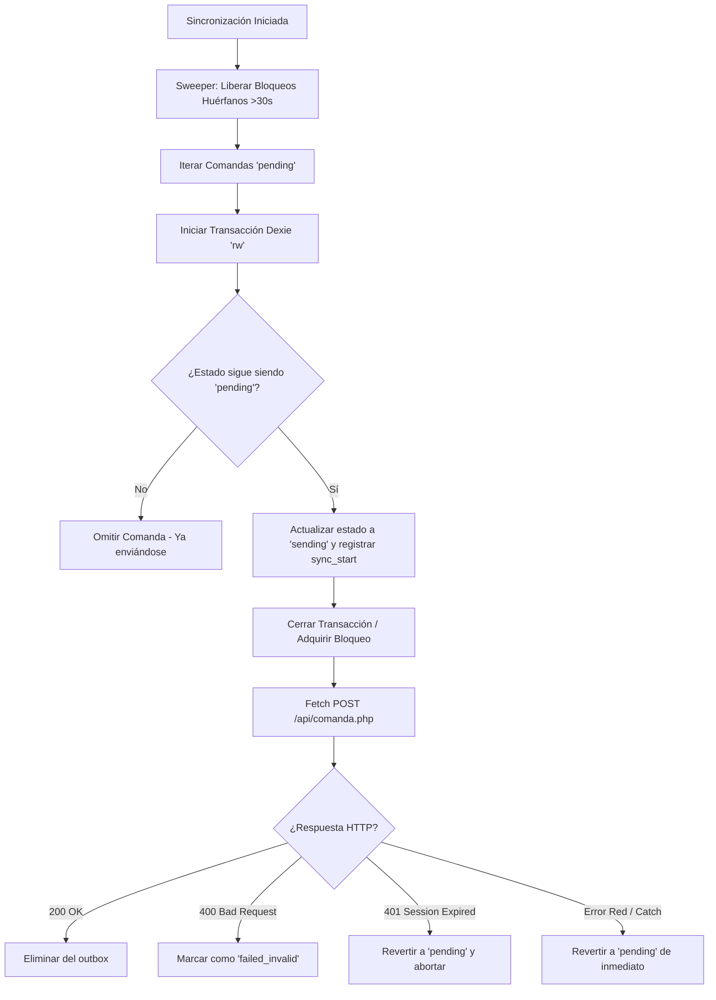

# Reporte de Auditoría y Hardening: Sincronización Offline, Persistencia Local y Delivery PWA

Este documento detalla los hallazgos de la auditoría del código de sincronización offline y persistencia local de la PWA del sistema de comandas, los problemas críticos identificados y las correcciones de arquitectura implementadas.

---

## 🔍 Resumen de Hallazgos y Vulnerabilidades Corregidas

Durante la revisión exhaustiva de `db.js`, `sw.js`, `global-indicators.js` y `app-voice.js`, se identificaron **dos fallos de seguridad y estabilidad críticos** y se implementaron mejoras clave:

### 1. Bloqueo por Comandas Corruptas ("Poison Pill" en Cola de Sincronización)
*   **Problema**: Cuando un mesero dictaba o enviaba una comanda incompleta (por ejemplo, sin mesa asignada debido a un fallo del transcriptor, o sin ítems válidos reconocidos), la PWA la guardaba en IndexedDB con `mesa_id: null` o `productos: []`.
*   **Comportamiento en Servidor**: Al intentar sincronizarse mediante `fetch('/restaurant/api/comanda.php')`, el backend de Flight PHP rechazaba la petición con un error `400 Bad Request` debido a la validación estricta de parámetros en `index.php`.
*   **Efecto de Bloqueo**: Las funciones de sincronización en primer plano (`db.js`) y segundo plano (`sw.js`) solo eliminan o actualizan el estado de la comanda si la respuesta es exitosa (`response.ok`). Al recibir un `400`, la comanda permanecía en estado `'pending'` de forma indefinida. En cada ciclo de sincronización subsecuente, la cola intentaba enviar el mismo paquete corrupto, fallaba continuamente y bloqueaba el envío de cualquier otra comanda válida que estuviese en espera detrás de ella.
*   **Solución Aplicada**:
    *   Se inyectó **Validación Poka-Yoke del lado del cliente** en `app-voice.js` antes de encolar. Si la mesa es inválida o el listado de productos está vacío, se impide el guardado local y se notifica visualmente al operador.
    *   Se modificaron los bucles de sincronización en `db.js` y `sw.js` para detectar errores de estado `400` del servidor. Al encontrar este código de error, el sistema marca de inmediato la comanda como `failed_invalid`, retirándola de la cola activa de reintentos para no bloquear la transmisión, pero reteniéndola en la base de datos IndexedDB local para fines de auditoría forense.

### 2. Discrepancia Crítica de Esquemas Dexie (Versión 2)
*   **Problema**: En `/web-assets/libs/models/global-indicators.js`, el script re-declaraba la base de datos `ComandasDB` bajo la misma versión 2 que `db.js`, pero usando un esquema inconsistente (declaraba el índice `created_at` en lugar de `timestamp`, no declaraba `timestamp` y omitía las tablas `catalog`, `notificaciones` y `telemetria_logs`).
*   **Efecto**: Dexie.js lanzaba de forma interna una excepción de tipo `SchemaError: Schema mismatch` al intentar abrir dos instancias diferentes del mismo esquema de base de datos en la misma ventana del navegador. Esto hacía que el código cayera silenciosamente en el bloque `catch` y el contador de comandas pendientes (Outbox Badge) nunca se mostrara ni se actualizara en el menú superior del mesero.
*   **Solución Aplicada**: Se alineó por completo la definición del esquema Dexie.js en `global-indicators.js` para reflejar de forma exacta las mismas tablas e índices de la versión 2 definidas en `db.js`.

---

## 🔒 Solución de Carrera de Hilos: Bloqueo Transaccional Exclusivo (`sending`)

Cuando el dispositivo recupera la conexión, el Service Worker (vía evento `sync`) y la página activa (vía evento `online` o manual) intentaban transmitir los mismos paquetes concurrentemente. Esto producía duplicados de comandas en cocina si ambas peticiones POST se procesaban de forma simultánea en el backend.

Se implementó un patrón de **Bloqueo de Estado Transicional (`sending`)** con mitigación de fallos integrada:

### 🛠️ Gaps Identificados y Mitigaciones Implementadas:

1.  **Gap de Bloqueo Huérfano (Tab o Red Caída a mitad de envío)**:
    *   *Riesgo*: Si el navegador se cierra o el proceso se interrumpe justo después de iniciar el `fetch` (mientras la comanda está marcada como `'sending'`), la comanda quedaría congelada en ese estado y no se volvería a intentar enviar jamás.
    *   *Mitigación*: Se implementaron las funciones `liberarComandasBloqueadas()` (en `db.js`) y `liberarComandasBloqueadasSW()` (en `sw.js`). Al inicio de cada ciclo de sincronización, se realiza un barrido (*sweep*) que detecta comandas en estado `'sending'` que lleven más de 30 segundos activas (basado en el campo `sync_start`) y las regresa a estado `'pending'`.
2.  **Gap de Recuperación Lenta (Retorno tardío a 'pending')**:
    *   *Riesgo*: Si la red se cae y el `fetch` falla, esperar los 30 segundos del *sweeper* retrasaría innecesariamente la entrega cuando la red regrese de inmediato.
    *   *Mitigación*: En el bloque `catch (err)` de ambas funciones, si la llamada de red falla por falta de internet, se revierte el estado de `'sending'` a `'pending'` **de inmediato**, permitiendo que el siguiente intento manual o de segundo plano intente enviarla tan pronto como haya red.

---

## 🛠️ Archivos Modificados

*   [`global-indicators.js`](file:///home/carlos/GitHub/caelitandem_home/restaurantb/www/web-assets/libs/models/global-indicators.js): Corregido el esquema de Dexie.js en la versión 2, inyectada sincronización proactiva en el evento `online` y la acción táctil interactiva para forzar envío de la cola.
*   [`app-voice.js`](file:///home/carlos/GitHub/caelitandem_home/restaurantb/www/web-assets/libs/models/app-voice.js): Añadida validación estricta cliente-side para evitar el registro de mesas inválidas (valores nulos) o comandas vacías.
*   [`db.js`](file:///home/carlos/GitHub/caelitandem_home/restaurantb/www/web-assets/pwa/db.js): Modificado el bucle de sincronización para controlar respuestas HTTP 400, expuesto el disparador en `window.forzarSincronizacionManual` e integrado el bloqueo transaccional `'sending'` con limpieza de bloqueos huérfanos.
*   [`sw.js`](file:///home/carlos/GitHub/caelitandem_home/restaurantb/www/web-assets/pwa/sw.js): Alineada la lógica de background sync con el control de estado HTTP 400 y el bloqueo transaccional `'sending'`.
